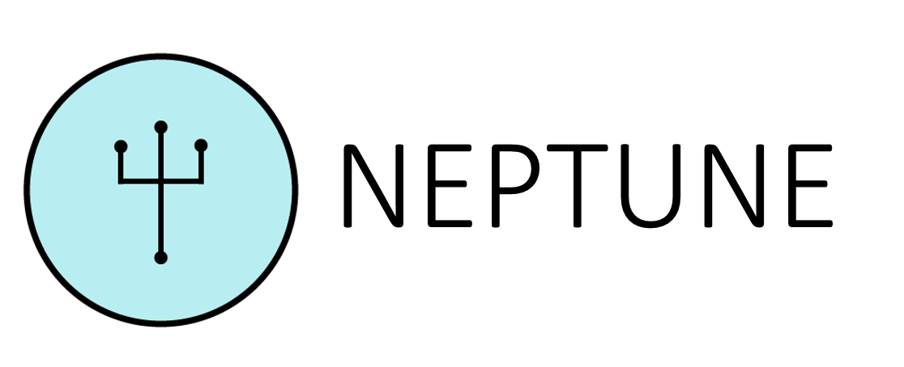

Neptune is a complete, end-to-end microfluidic design suite for synthetic biologists. With Neptune, researchers and microfluidic designers have all the tools needed to design, fabricate, and control microfluidic devices. Neptune supports high level specification of a microfluidic chips layout and function. This high level specification includes a library of predefined microfluidic components commonly used in designs, including valves, gradient generators, serpentine mixers, and droplet generators. Neptune also provides a interface where researchers can control their microfluidic chip in real time. Fluid flow can be manipulated directly from the interface, making Neptune an ideal tool for running and controlling microfluidic chip experiments. Neptune also interfaces with and sources only low cost, open and readily available tools to fabricate and control microfluidic chips; Neptune provides a 3D printed control infrastructure for your chip, and fabrication itself leverages the MakerFluidics workflow to create the chip using a CNC mill. 

If you are want to design a microfluidic chip using Neptune, there are two ways to do so: either you begin by writing an LFR specification (see [LFR Specification](#lfr-specification)), or you can begin with a more detailed MINT description (see MINT elaboration). 

If you want to assemble control infrastructure for a microfluidic device, Neptune provides 3D printed design schematics for the hardware (see 3D Printed Control Infrastructure), and an explanation of how to assemble an Arduino-enabled pump array (see Assembly). 

If you want to control you microfluidic device to run an experiment, Neptune provides a control interface to let you manipulate valves and generate pressure gradients to drive fluid flow (see Control). 

And please, for installation, see Install and Run Neptune 

## LFR Specification 

To create microfluidic chip designs in Neptune, 

## MINT Elaboration

## 3D Printed Control Infrastructure 

## Assembly 

## Control 

## Install and Run Neptune 

## Contributions and Attributions 

## Contact Us 
If you would like to receive updates from the Neptune team regarding bug fixes, patches, feature updates, or if you would like to contact the Neptune team, please check the links in [CONTACT.md](CONTACT.md). 

bu.igemhw2016@gmail.com
