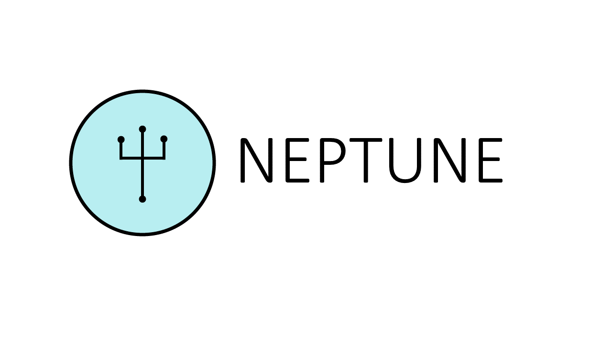

Neptune is a complete, end-to-end microfluidic design suite for synthetic biologists. With Neptune, researchers and microfluidic designers have all the tools needed to design, fabricate, and control microfluidic devices. Neptune supports high level specification of a microfluidic chips layout and function. This high level specification includes a library of predefined microfluidic components commonly used in designs, including valves, gradient generators, serpentine mixers, and droplet generators. Neptune also provides a interface where researchers can control their microfluidic chip in real time. Fluid flow can be manipulated directly from the interface, making Neptune an ideal tool for running and controlling microfluidic chip experiments. Most importantly, Neptune interfaces with and sources only low cost, open source and readily available tools to fabricate and control microfluidic chips- Neptune provides a 3D printed control infrastructure for your chip, and fabrication itself leverages the MakerFluidics workflow to create the chip using a CNC mill. 

## LFR Specification 

## MINT Elaboration

## 3D Printed Control Infrastructure 

## Assembly 

## Control 

## Install and Run Neptune 

## Contributions and Attributions 

## Contact Us 
If you would like to receive updates from the Neptune team regarding bug fixes, patches, feature updates, or if you would like to contact the Neptune team, please check the links in [CONTACT.md](CONTACT.md). 

bu.igemhw2016@gmail.com
